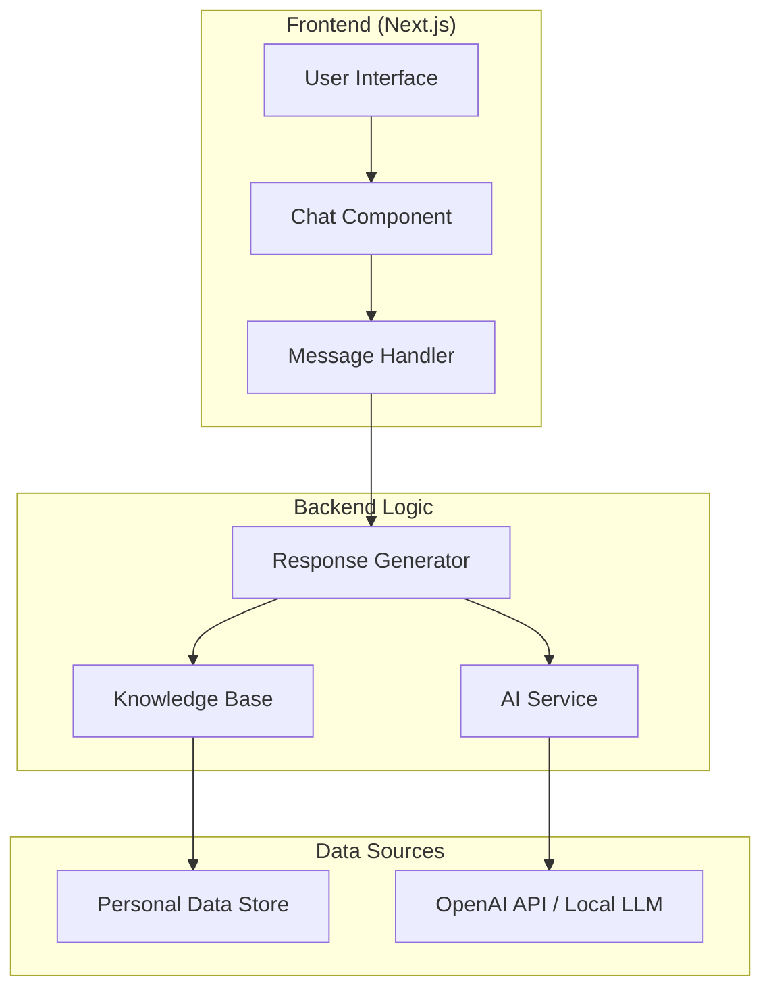

# Design Document

## Overview

The portfolio chatbot will be an interactive AI assistant that represents Mohd Uwaish and can answer visitor questions about his background, skills, experience, and projects. The chatbot will be integrated into the existing Next.js portfolio website using a modern, responsive chat interface that matches the current design aesthetic.

The system will use a combination of structured data about Mohd Uwaish and a conversational AI approach to provide natural, engaging responses. The chatbot will be positioned as a floating chat widget that visitors can access from any page of the portfolio.

## Architecture

### High-Level Architecture



### Component Architecture

1. **Chat Widget**: Floating chat interface with minimize/maximize functionality
2. **Message Handler**: Processes user input and manages conversation flow
3. **Response Generator**: Combines structured data with AI to generate contextual responses
4. **Knowledge Base**: Structured data about Mohd Uwaish extracted from existing portfolio components
5. **AI Integration**: OpenAI API or local LLM for natural language processing

## Components and Interfaces

### 1. Chat Widget Component (`ChatWidget`)

**Purpose**: Main chat interface that floats on the portfolio website

**Props**:
- `isOpen: boolean` - Controls widget visibility
- `onToggle: () => void` - Toggle function for open/close state

**Features**:
- Floating position (bottom-right corner)
- Responsive design for mobile and desktop
- Smooth animations using Framer Motion
- Minimized state showing only chat icon
- Expanded state showing full chat interface

### 2. Chat Interface Component (`ChatInterface`)

**Purpose**: The main chat conversation area

**Props**:
- `messages: Message[]` - Array of conversation messages
- `onSendMessage: (message: string) => void` - Send message handler
- `isLoading: boolean` - Loading state for AI responses

**Features**:
- Message history display
- Typing indicator
- Auto-scroll to latest message
- Message timestamps
- User/bot message differentiation

### 3. Message Component (`Message`)

**Purpose**: Individual message display

**Props**:
- `message: Message` - Message object with content, sender, timestamp
- `isBot: boolean` - Determines styling and layout

**Features**:
- Different styling for user vs bot messages
- Markdown support for rich text responses
- Timestamp display
- Avatar/icon for bot messages

### 4. Knowledge Base Service (`KnowledgeBase`)

**Purpose**: Manages structured data about Mohd Uwaish

**Methods**:
- `getPersonalInfo(): PersonalInfo` - Basic personal information
- `getSkills(): Skill[]` - Technical skills with proficiency levels
- `getExperience(): Experience[]` - Work experience details
- `getProjects(): Project[]` - Project information
- `getEducation(): Education[]` - Educational background
- `searchContent(query: string): SearchResult[]` - Search across all data

### 5. Response Generator Service (`ResponseGenerator`)

**Purpose**: Generates contextual responses using AI and structured data

**Methods**:
- `generateResponse(userMessage: string, context: ConversationContext): Promise<string>`
- `extractIntent(message: string): Intent` - Determines user intent
- `getRelevantData(intent: Intent): any[]` - Retrieves relevant structured data
- `formatResponse(data: any[], aiResponse: string): string` - Combines data with AI response

## Data Models

### Message Interface
```typescript
interface Message {
  id: string;
  content: string;
  sender: 'user' | 'bot';
  timestamp: Date;
  type?: 'text' | 'typing';
}
```

### Personal Info Interface
```typescript
interface PersonalInfo {
  name: string;
  title: string;
  email: string;
  location: string;
  availability: string;
  bio: string;
  interests: string[];
}
```

### Skill Interface
```typescript
interface Skill {
  name: string;
  category: 'frontend' | 'backend' | 'database' | 'rag' | 'other';
  level: number; // 1-100
  description?: string;
}
```

### Experience Interface
```typescript
interface Experience {
  id: number;
  title: string;
  company: string;
  location: string;
  period: string;
  description: string;
  achievements: string[];
  skills: string[];
}
```

### Project Interface
```typescript
interface Project {
  id: number;
  title: string;
  description: string;
  tags: string[];
  liveUrl?: string;
  githubUrl?: string;
  image?: string;
}
```

### Conversation Context Interface
```typescript
interface ConversationContext {
  messages: Message[];
  currentTopic?: string;
  userIntent?: Intent;
  lastAskedAbout?: string;
}
```

## Error Handling

### User Input Validation
- Sanitize user input to prevent XSS attacks
- Limit message length to prevent abuse
- Rate limiting to prevent spam

### AI Service Error Handling
- Fallback responses when AI service is unavailable
- Graceful degradation to structured responses only
- Retry logic with exponential backoff
- Error logging for debugging

### Network Error Handling
- Offline detection and appropriate messaging
- Request timeout handling
- Connection retry mechanisms

### Conversation Flow Error Handling
- Handle unclear or ambiguous user queries
- Provide helpful suggestions when chatbot can't answer
- Graceful handling of context loss in long conversations

## Testing Strategy

### Unit Testing
- Test individual components in isolation
- Mock AI service responses for consistent testing
- Test knowledge base data retrieval functions
- Validate message formatting and sanitization

### Integration Testing
- Test chat widget integration with main portfolio
- Test AI service integration with different input types
- Test responsive behavior across devices
- Test conversation flow scenarios

### End-to-End Testing
- Test complete user conversation flows
- Test chatbot responses to various question types
- Test error scenarios and fallback behaviors
- Test accessibility features

### Performance Testing
- Test response times for different query types
- Test memory usage during long conversations
- Test concurrent user scenarios
- Test mobile performance and battery usage

### User Experience Testing
- Test conversation naturalness and helpfulness
- Test chatbot personality consistency
- Test ease of use across different user types
- Test accessibility compliance

## Implementation Approach

### Phase 1: Core Infrastructure
- Set up basic chat widget component
- Implement message handling and display
- Create knowledge base with structured data
- Basic response generation without AI

### Phase 2: AI Integration
- Integrate OpenAI API or local LLM
- Implement intelligent response generation
- Add conversation context management
- Implement intent recognition

### Phase 3: Enhanced Features
- Add typing indicators and animations
- Implement conversation history persistence
- Add advanced error handling
- Optimize performance and caching

### Phase 4: Polish and Testing
- Comprehensive testing across all scenarios
- Accessibility improvements
- Performance optimization
- User feedback integration

## Technology Choices

### Frontend Framework
- **Next.js 13+**: Already used in the portfolio, provides SSR and API routes
- **React 18**: Component-based architecture with hooks
- **TypeScript**: Type safety for better development experience

### Styling
- **Tailwind CSS**: Consistent with existing portfolio styling
- **Framer Motion**: Smooth animations for chat interactions
- **Radix UI**: Accessible component primitives

### AI Integration
- **OpenAI API**: GPT-3.5/4 for natural language processing
- **Alternative**: Local LLM using Ollama for privacy-focused approach
- **Fallback**: Rule-based responses using structured data

### State Management
- **React Context**: For chat state management
- **Local Storage**: For conversation persistence
- **Session Storage**: For temporary conversation context

### Data Storage
- **Static JSON**: For structured personal data
- **Local Storage**: For user preferences and conversation history
- **Optional**: Database integration for analytics (future enhancement)

## Security Considerations

### Input Sanitization
- Sanitize all user inputs to prevent XSS
- Validate message content and length
- Filter potentially harmful content

### API Security
- Secure API key management for AI services
- Rate limiting to prevent abuse
- Input validation on all API endpoints

### Privacy Protection
- No storage of personal user information
- Optional conversation history with user consent
- Clear privacy policy for chatbot interactions

### Content Security
- Ensure chatbot responses are appropriate
- Filter sensitive information from responses
- Implement content moderation for user inputs